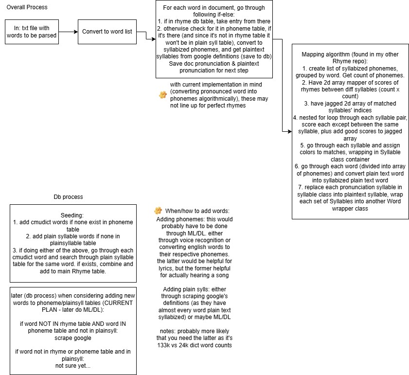

# rhymeo

idea: console app that color codes rhyme scheme
details:

- input: file containing lyrics/poem
- for each word, looks up phonemes in saved json dictionary
- if nothing is found, program web scrapes for pronunciation and syllable division of words, saving info in json dictionary
- use mapping algorithm to color code
- use spectre console to display color coded rhyme scheme on the console

dependencies:

- Spectre.Console
- entity framework core with sqlite

future thoughts:

- allow for live recording of voice, outputting words to screen and automatically color coding it
- allow for different file types like docx?

process:

items:

- cmudict (for syllabized(ish) pronunciation of words)
- google definitions (for syllabized words in regular english (non-pronunciation))
-
